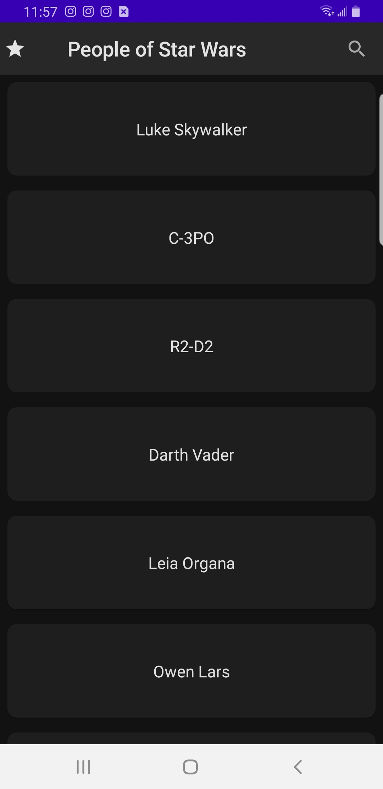
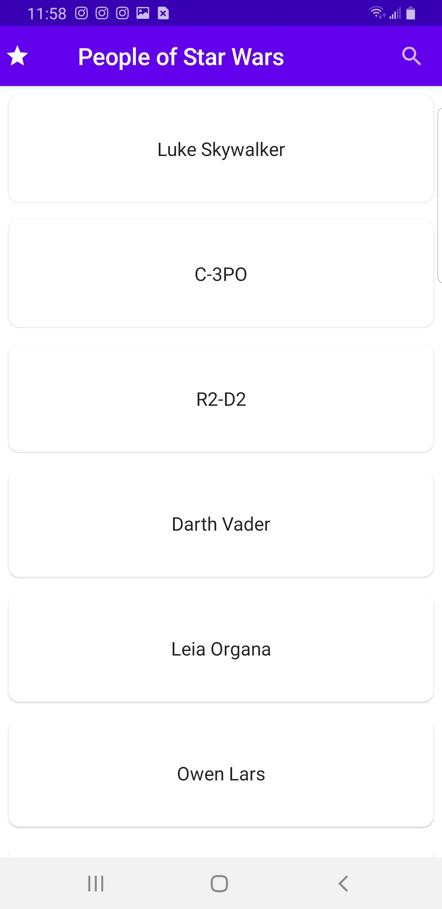
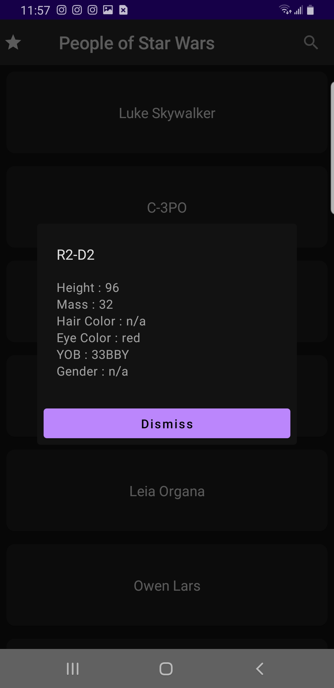
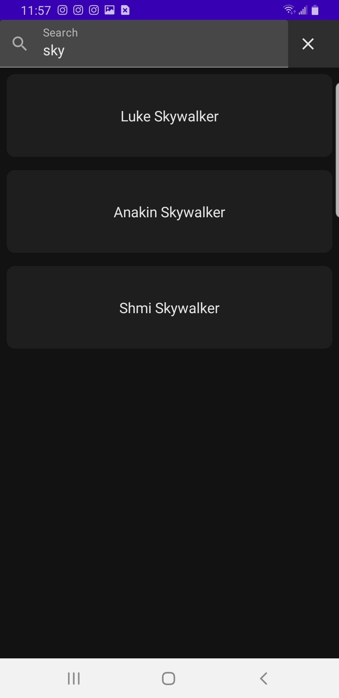
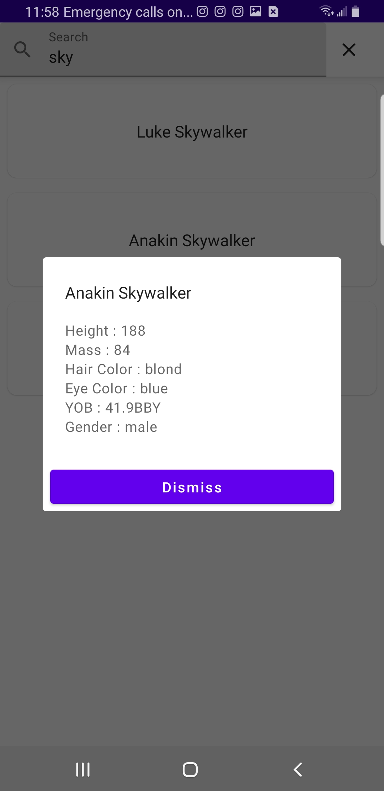
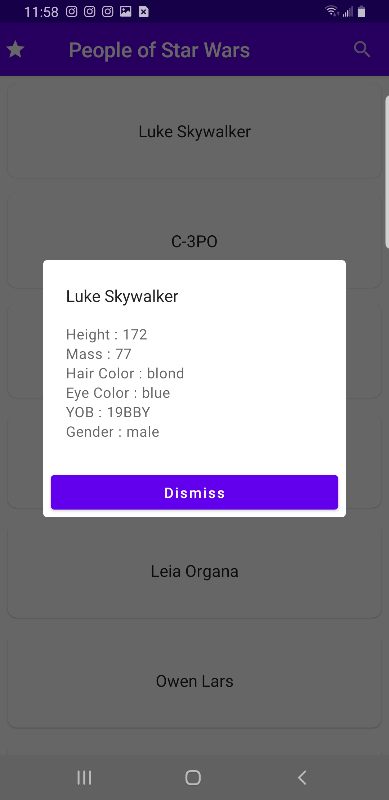

# Star Wars Character App
An Android app built with Jetpack Compose to consume the Star Wars API, with data from [SWAPI](https://swapi.dev/api/people/1/) consumed via Cloud functions [repo](https://github.com/Bavon101/star_wars_api)

  
  
  

  
  
  

## Built With

- Kotlin
- Jetpack
- Cloud Functions
### Setup

- Clone the GitHub Repository
- Go to the Project Directory
## 📝 License

This project is [MIT](./LICENSE) licensed.